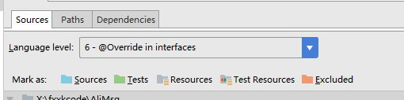
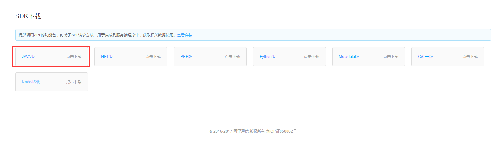

本项目使用阿里大于服务

注意点:
1. 编译的时候需要java6以上

2. 需要自行下载淘宝的jar添加到项目环境中

[下载地址](https://www.alidayu.com/center/application/sdk)

3. 将resources下的core.properties.sample改为core.properties，并填写相关配置

[参考文档](http://open.taobao.com/docs/api.htm?spm=a219a.7395905.0.0.mh46qn&apiId=25450)
